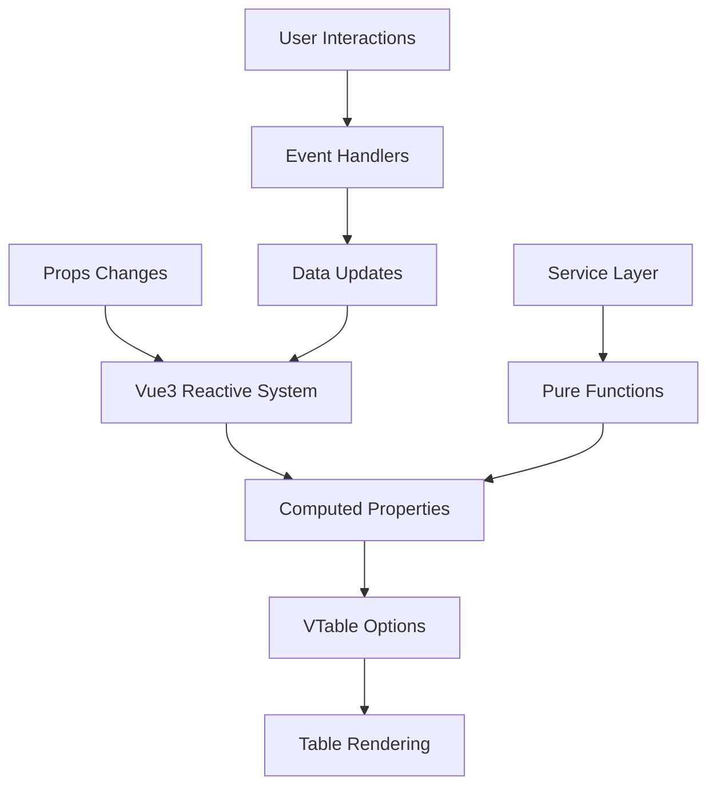
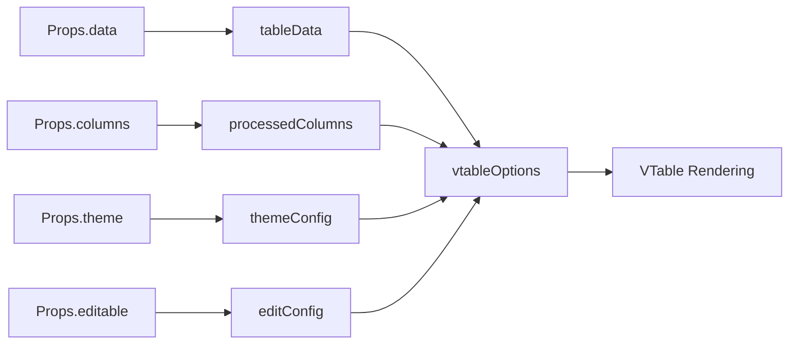
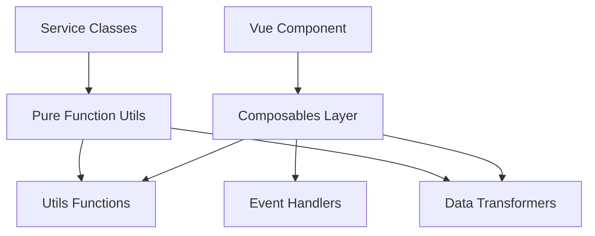
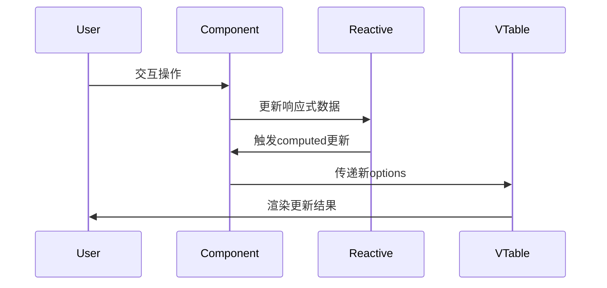
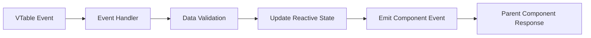
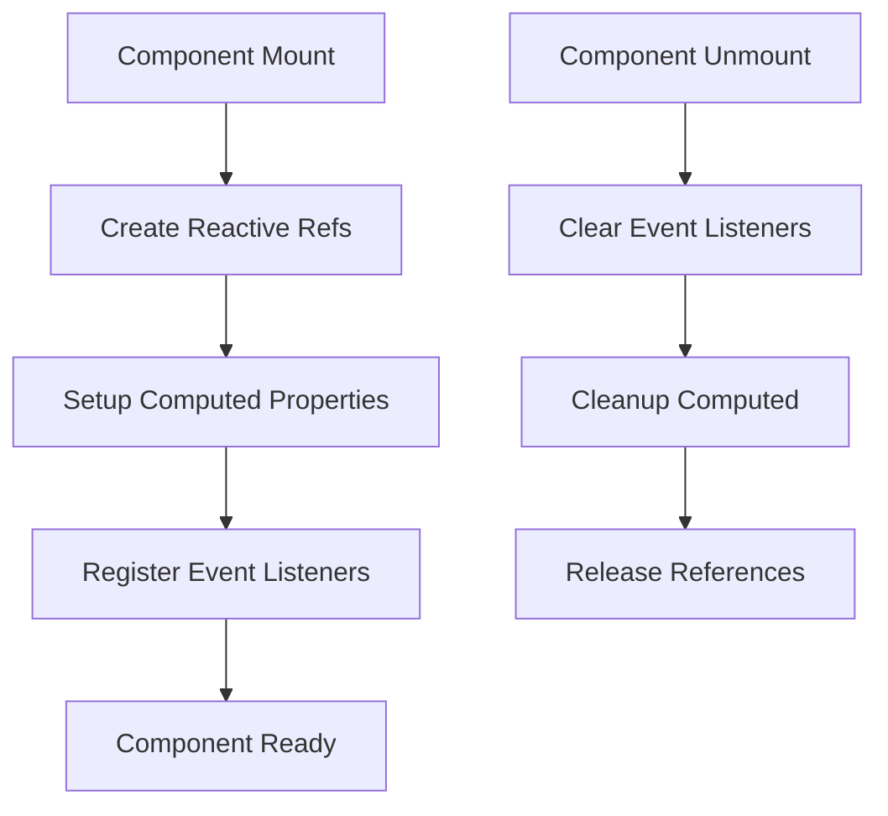

# DataGridView 代码清理与响应式修复设计

## 概述

本设计文档旨在解决 DataGridView 组件在Vue3环境中的响应式问题和代码清理需求。经过分析发现，当前实现中过度封装的服务类架构与Vue3的响应式系统存在兼容性问题，导致vtableOptions computed失效、功能异常以及无效引用。

### 核心问题

| 问题类型 | 具体表现 | 影响程度 |
|---------|---------|---------|
| 响应式丢失 | vtableOptions computed内部值非响应式 | 高 |
| 功能失效 | 二次quest后代码增加但功能异常 | 高 |
| 过度封装 | 服务类与Vue3响应式系统不兼容 | 中 |
| 无效引用 | 未使用的导入和代码 | 低 |

## 架构重构策略

### 响应式数据流设计

### 重构原则

| 原则 | 描述 | 实现方式 |
|-----|------|---------|
| 响应式优先 | 所有数据变更通过Vue3响应式系统 | 使用ref/reactive管理状态 |
| 轻量化服务 | 服务类仅提供纯函数工具方法 | 移除服务类内部状态 |
| 单一职责 | 每个函数只处理一个明确任务 | 拆分复杂逻辑为独立函数 |
| 接口清晰 | 明确输入输出，避免副作用 | 纯函数设计模式 |

## 数据模型重设计

### 核心响应式状态

| 状态名称 | 类型 | 职责 | 响应式方案 |
|---------|------|------|-----------|
| tableData | Ref<Array> | 表格数据管理 | ref() |
| columnConfig | Ref<Array> | 列配置管理 | ref() |
| tableOptions | ComputedRef | VTable配置选项 | computed() |
| selectionState | Ref<Object> | 选择状态管理 | ref() |
| editingState | Ref<Object> | 编辑状态管理 | ref() |

### 计算属性依赖关系

## 服务层轻量化重构

### 现有服务类问题分析

| 服务类 | 问题 | 重构方案 |
|-------|------|---------|
| TableRenderer | 内部状态管理与Vue响应式冲突 | 转为纯函数工具集 |
| EditingService | 复杂状态管理，响应式失效 | 简化为编辑工具函数 |
| DataManagement | 数据副本管理，导致状态不同步 | 移除，直接操作Vue响应式数据 |
| SelectionService | 选择状态独立管理 | 集成到组件响应式状态 |

### 重构后服务架构

### 工具函数设计

| 工具模块 | 函数列表 | 输入 | 输出 |
|----------|----------|------|------|
| ColumnProcessor | processColumns | columns, config | processedColumns |
| OptionBuilder | buildVTableOptions | config object | vtable options |
| DataValidator | validateCell | value, column | validation result |
| EventTransformer | transformEvent | raw event | normalized event |

## 响应式系统集成方案

### Composables 设计

| Composable | 职责 | 返回值 |
|------------|------|--------|
| useTableData | 数据管理 | { data, updateData, addRow, removeRow } |
| useTableSelection | 选择管理 | { selectedRows, selectRow, clearSelection } |
| useTableEditing | 编辑管理 | { editingCell, startEdit, endEdit } |
| useTableOptions | 配置生成 | { vtableOptions } |

### 响应式数据更新流程

## 事件处理优化

### 事件处理器简化

| 事件类型 | 当前处理方式 | 优化后方式 |
|----------|-------------|-----------|
| cell-edit | 通过服务类处理 | 直接更新响应式数据 |
| row-select | 服务类状态管理 | 组件内响应式状态 |
| sort-change | 服务类排序逻辑 | 工具函数 + 响应式更新 |

### 事件流程图

## 无效代码清理策略

### 清理检查列表

| 清理项目 | 检查范围 | 清理标准 |
|----------|----------|---------|
| 未使用导入 | 所有import语句 | 静态分析 + 手动验证 |
| 冗余服务类 | services目录 | 功能重叠分析 |
| 废弃方法 | 组件methods | 调用关系分析 |
| 无效类型定义 | types.ts | 使用频率统计 |

### 代码复用优化

| 复用场景 | 当前状态 | 优化方案 |
|----------|----------|---------|
| 数据验证逻辑 | 分散在多处 | 统一到utils/validation |
| 事件转换逻辑 | 重复实现 | 提取为通用函数 |
| 主题配置处理 | 硬编码 | 配置化管理 |

## 性能优化考虑

### 计算属性优化

| 优化点 | 问题 | 解决方案 |
|-------|------|---------|
| vtableOptions | 频繁重计算 | 细粒度依赖控制 |
| processedColumns | 不必要更新 | 缓存机制 |
| 大数据渲染 | 响应性能问题 | 虚拟化处理 |

### 内存管理

## 测试策略

### 响应式测试重点

| 测试场景 | 验证点 | 测试方法 |
|----------|--------|---------|
| 数据变更响应 | vtableOptions自动更新 | 单元测试 |
| 主题切换 | 样式实时生效 | 集成测试 |
| 编辑状态同步 | 编辑器状态一致 | E2E测试 |

### 兼容性验证

| 验证项目 | 测试环境 | 预期结果 |
|----------|----------|---------|
| Vue3响应式 | Composition API | 完全兼容 |
| VTable集成 | 最新版本 | 功能正常 |
| TypeScript支持 | 严格模式 | 类型安全 |

## 实施计划

### 重构阶段

| 阶段 | 任务 | 时间预估 | 风险等级 |
|------|------|----------|---------|
| 阶段1 | 响应式状态重构 | 2天 | 中 |
| 阶段2 | 服务类轻量化 | 1天 | 低 |
| 阶段3 | 事件处理优化 | 1天 | 低 |
| 阶段4 | 代码清理 | 0.5天 | 低 |
| 阶段5 | 测试验证 | 1天 | 中 |

### 质量保证

| 检查点 | 验证方式 | 通过标准 |
|-------|----------|---------|
| 功能完整性 | 回归测试 | 100%通过 |
| 响应式正确性 | 手动测试 | 实时响应 |
| 性能表现 | 基准测试 | 不低于重构前 |
| 代码质量 | 静态分析 | 0错误0警告 |