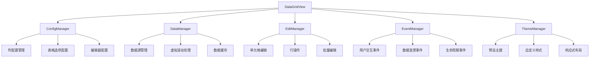
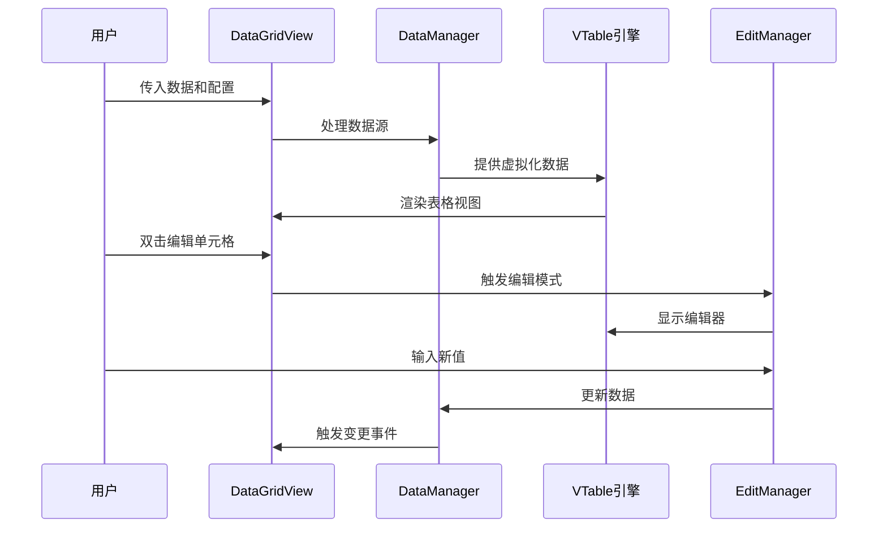

# DataGridView 组件封装设计

## 概述

基于 vTable 库封装一个类似于 WinForm DataGridView 的高性能数据表格组件，具备大数据量展示和编辑能力。该组件旨在为 Vue 3 应用提供一个易用、高性能的数据表格解决方案，支持虚拟滚动、实时编辑、多种数据操作和自定义配置。

### 设计目标

- **高性能**：支持百万级数据展示，利用虚拟滚动技术保证流畅体验
- **易用性**：提供简洁的 API 接口，开发者可快速集成到各个页面模块
- **功能完整**：涵盖数据展示、编辑、排序、筛选、分页等核心功能
- **可扩展**：支持自定义单元格渲染、编辑器、主题等扩展能力

## 技术栈与依赖

| 技术 | 版本 | 用途 |
|------|------|------|
| Vue | 3.5+ | 组件开发框架 |
| @visactor/vue-vtable | 1.20+ | 底层表格渲染引擎 |
| @visactor/vtable-editors | 1.20+ | 表格编辑器支持 |
| TypeScript | 5.8+ | 类型安全 |
| Vite | 6.2+ | 构建工具 |

## 组件架构

### 核心组件结构



### 数据流架构



## 组件定义

### DataGridView 主组件

#### Props 接口定义

| 属性名 | 类型 | 默认值 | 说明 |
|--------|------|--------|------|
| data | Array<Record<string, any>> | [] | 表格数据源 |
| columns | Array<ColumnConfig> | [] | 列配置定义 |
| height | number \| string | 'auto' | 表格高度 |
| width | number \| string | '100%' | 表格宽度 |
| virtualScroll | boolean | true | 是否启用虚拟滚动 |
| editable | boolean | true | 是否允许编辑 |
| selectable | boolean | true | 是否允许选择 |
| theme | string | 'arco' | 主题名称 |
| pagination | PaginationConfig \| false | false | 分页配置 |
| sortable | boolean | true | 是否允许排序 |
| filterable | boolean | true | 是否允许筛选 |
| loading | boolean | false | 加载状态 |

#### 事件定义

| 事件名 | 参数 | 说明 |
|--------|------|------|
| cell-edit | (rowIndex, field, newValue, oldValue) | 单元格编辑完成 |
| row-select | (selectedRows, selectedRowData) | 行选择变化 |
| sort-change | (field, direction) | 排序变化 |
| filter-change | (filters) | 筛选条件变化 |
| page-change | (page, pageSize) | 分页变化 |
| data-change | (newData, changeType, changeInfo) | 数据变更 |

### ColumnConfig 列配置

| 属性名 | 类型 | 说明 |
|--------|------|------|
| field | string | 数据字段名 |
| title | string | 列标题 |
| width | number | 列宽度 |
| minWidth | number | 最小宽度 |
| maxWidth | number | 最大宽度 |
| resizable | boolean | 是否可调整宽度 |
| sortable | boolean | 是否可排序 |
| filterable | boolean | 是否可筛选 |
| editable | boolean | 是否可编辑 |
| editor | EditorConfig | 编辑器配置 |
| renderer | RendererConfig | 自定义渲染器 |
| align | 'left' \| 'center' \| 'right' | 对齐方式 |
| fixed | 'left' \| 'right' | 固定列 |
| hide | boolean | 是否隐藏 |

### EditorConfig 编辑器配置

| 编辑器类型 | 配置选项 | 使用场景 |
|------------|----------|----------|
| input | placeholder, maxLength | 文本输入 |
| number | min, max, step, precision | 数值输入 |
| select | options, multiple | 下拉选择 |
| date | format, disabledDate | 日期选择 |
| checkbox | - | 布尔值 |
| textarea | rows, maxLength | 多行文本 |
| custom | component, props | 自定义编辑器 |

## 功能模块设计

### 1. 数据管理模块

#### 数据源处理
- 支持静态数据和异步数据加载
- 提供数据转换和格式化能力
- 实现数据缓存和增量更新机制

#### 虚拟滚动优化
- 基于 vTable 的虚拟滚动能力
- 动态计算可视区域数据
- 支持大数据量（100万+行）流畅滚动

#### 数据操作接口
- 增加行：addRow(data, index?)
- 删除行：removeRow(index | indices)
- 更新行：updateRow(index, data)
- 批量操作：batchUpdate(operations)

### 2. 编辑功能模块

#### 单元格编辑
- 双击或按键触发编辑模式
- 支持多种内置编辑器类型
- 提供编辑验证和错误提示
- 支持编辑取消和确认操作

#### 行级操作
- 整行编辑模式
- 新增行功能
- 删除行确认机制
- 批量编辑选中行

#### 编辑状态管理
- 跟踪编辑状态变化
- 提供撤销/重做能力
- 支持编辑冲突检测

### 3. 交互功能模块

#### 排序功能
- 单列排序和多列排序
- 自定义排序算法
- 排序状态持久化

#### 筛选功能
- 列头筛选器
- 高级筛选对话框
- 自定义筛选条件
- 筛选结果统计

#### 选择功能
- 单行/多行选择
- 全选/反选操作
- 选择状态持久化
- 跨页选择支持

### 4. 布局与样式模块

#### 响应式布局
- 自适应容器大小
- 列宽自动调整
- 移动端适配支持

#### 主题系统
- 预设主题（Arco、Ant Design等）
- 自定义主题配置
- 深色/浅色模式支持
- CSS 变量系统

#### 样式定制
- 单元格样式配置
- 条件格式化
- 斑马纹和网格线
- 自定义 CSS 类

## 性能优化策略

### 虚拟滚动实现
- 利用 vTable 的虚拟滚动引擎
- 智能预加载缓冲区数据
- 内存使用优化和垃圾回收

### 渲染优化
- 按需渲染可视区域
- 防抖处理频繁操作
- 异步更新和批量渲染

### 数据处理优化
- 懒加载和分片处理
- 数据索引和缓存策略
- Web Worker 支持大数据处理

## API 设计参考

### 组件使用示例

#### 基础用法
```typescript
// 基础表格配置
const columns = [
  { field: 'id', title: 'ID', width: 80, sortable: true },
  { field: 'name', title: '姓名', width: 120, editable: true },
  { field: 'age', title: '年龄', width: 80, editor: { type: 'number' } },
  { field: 'email', title: '邮箱', width: 200, editable: true }
]

const data = [
  { id: 1, name: '张三', age: 25, email: 'zhangsan@example.com' },
  // ... 更多数据
]
```

#### 高级配置
```typescript
// 自定义编辑器和渲染器
const advancedColumns = [
  {
    field: 'status',
    title: '状态',
    editor: {
      type: 'select',
      options: [
        { label: '激活', value: 'active' },
        { label: '禁用', value: 'disabled' }
      ]
    },
    renderer: {
      type: 'tag',
      colorMap: { active: 'green', disabled: 'red' }
    }
  }
]
```

### 方法接口

| 方法名 | 参数 | 返回值 | 说明 |
|--------|------|--------|------|
| getData | () | Array | 获取当前表格数据 |
| setData | (data: Array) | void | 设置表格数据 |
| getSelectedRows | () | Array | 获取选中行数据 |
| clearSelection | () | void | 清空选择 |
| exportData | (format: string) | string | 导出数据 |
| refresh | () | void | 刷新表格 |
| scrollTo | (index: number) | void | 滚动到指定行 |

## 测试策略

### 单元测试覆盖
- 组件属性和事件测试
- 数据操作方法测试
- 编辑功能测试
- 性能基准测试

### 集成测试
- 大数据量渲染测试
- 用户交互流程测试
- 浏览器兼容性测试
- 移动端适配测试

### 性能测试指标
- 10万行数据渲染时间 < 1秒
- 滚动帧率保持 60fps
- 内存使用稳定，无内存泄漏
- 编辑响应时间 < 100ms