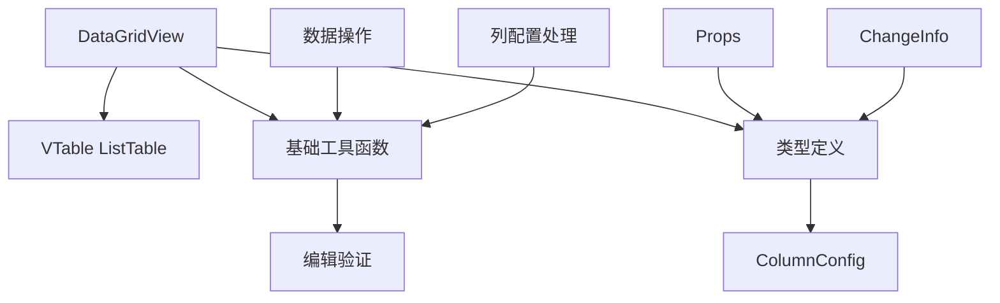

# DataGridView 组件代码清理与优化设计

## 1. 概述

### 当前问题分析
通过对 DataGridView 组件的分析，发现存在以下问题：
- services 目录下存在大量未被使用的服务类
- 存在过度封装，与 VTable 的原生 Vue 组件重复功能
- Props 设计存在冗余和不合理之处
- 类型定义过于复杂，包含未使用的接口

### 优化目标
- 移除未使用的代码，减少心智负担
- 简化组件结构，避免过度封装
- 优化 Props 设计，提高易用性
- 重新设计组件架构，更好地利用 VTable 原生能力

## 2. 技术架构分析

### VTable 原生能力分析
基于 `@visactor/vue-vtable` 包的 ListTable 组件已经提供：
- 完整的 Vue 3 响应式支持
- 事件系统（ready、cell_edit_end、select_cell、sort_click 等）
- Options 配置系统
- 内置编辑器支持
- 主题系统

### 当前封装层分析

| 层级 | 组件/服务 | 状态 | 建议 |
|------|-----------|------|------|
| 表现层 | DataGridView/index.vue | 保留 | 简化，直接使用 VTable props |
| 服务层 | services/* | 冗余 | 大部分移除 |
| 工具层 | utils/* | 部分有用 | 保留核心工具函数 |
| 类型层 | types.ts | 过度设计 | 简化类型定义 |

## 3. 代码清理方案

### 3.1 移除未使用的 Services

#### 完全移除的服务
- `base-service.legacy.ts` - 已被新版本替代
- `base-service.ts` - 事件系统被 Vue 原生替代
- `context-menu-service.ts` - VTable 原生支持右键菜单
- `data-management.ts` - 数据管理通过 Vue 响应式系统处理
- `editing-service.legacy.ts` - 已被新版本替代
- `keyboard-service.ts` - VTable 原生支持键盘操作
- `navigation-service.ts` - VTable 原生支持导航
- `selection-service.ts` - VTable 原生支持选择
- `sorting-service.ts` - VTable 原生支持排序
- `theme-service.ts` - VTable 原生支持主题切换
- `table-renderer.legacy.ts` - 已被新版本替代

#### 保留简化的服务
- `editing-service.ts` - 简化后保留，主要用于向后兼容
- `table-renderer.ts` - 简化后保留，主要用于向后兼容

#### 移除理由

| 服务类 | 移除理由 |
|--------|----------|
| BaseService | Vue 3 原生事件系统更优，无需自建事件机制 |
| ContextMenuService | VTable 原生支持 contextmenu 配置 |
| DataManagement | Vue 响应式数据管理更简洁高效 |
| KeyboardService | VTable 原生 keyboardOptions 配置 |
| NavigationService | VTable 原生支持焦点和导航 |
| SelectionService | VTable 原生支持选择配置 |
| SortingService | VTable 原生支持排序配置 |
| ThemeService | VTable 原生主题系统 |

### 3.2 简化 Props 设计

#### 当前 Props 问题
- `virtualScroll` - VTable 默认支持，无需额外配置
- `filterable` - 当前未实现，应移除
- `theme` - 可直接通过 vtableOptions.theme 配置
- `sortable` - 可通过列配置控制

#### 优化后的 Props

```typescript
export interface DataGridViewProps {
  // 核心数据
  data: Array<Record<string, any>>
  columns: Array<ColumnConfig>
  
  // 布局配置
  height?: number | string  // 默认为 'auto'，使用 VTable 原生 heightMode: 'autoHeight'
  width?: number | string
  
  // 功能开关
  editable?: boolean
  loading?: boolean
  
  // VTable 原生配置透传
  vtableOptions?: Record<string, any>
}
```

#### 移除的 Props
- `virtualScroll` - VTable 默认开启
- `selectable` - 通过 vtableOptions.select 配置
- `theme` - 通过 vtableOptions.theme 配置
- `sortable` - 通过列配置的 sortable 属性控制
- `filterable` - 功能未实现且 VTable 原生支持

#### 默认值调整
- `height` - 默认值从 `'auto'` 改为使用 VTable 原生 `heightMode: 'autoHeight'` 配置
- 移除组件内部的高度计算逻辑，直接使用 VTable 自动高度能力

### 3.3 简化类型定义

#### 移除复杂类型接口
- `EditorConfig` - 过度复杂，直接使用 VTable 原生配置
- `RendererConfig` - 过度复杂，直接使用 VTable 原生配置
- `ContextMenuConfig` - 移除相关服务后不再需要
- `FilterCondition` - 功能未实现
- `DataGridViewEvents` - Vue 原生事件类型定义即可
- `DataGridViewMethods` - defineExpose 自动推导类型

#### 保留简化的类型

```typescript
export interface ColumnConfig {
  field: string
  title: string
  width?: number
  minWidth?: number
  maxWidth?: number
  editable?: boolean
  sortable?: boolean
  // VTable 原生属性透传
  [key: string]: any
}

export interface ChangeInfo {
  type: 'add' | 'update' | 'delete'
  rowIndex?: number
  field?: string
  oldValue?: any
  newValue?: any
}

export interface DataGridViewProps {
  data: Array<Record<string, any>>
  columns: Array<ColumnConfig>
  height?: number | string  // 默认使用 VTable 的 heightMode: 'autoHeight'
  width?: number | string
  editable?: boolean
  loading?: boolean
  vtableOptions?: Record<string, any>
}
```

### 3.4 组件代码简化

#### 移除冗余代码
- 复杂的选择状态管理 - 使用 VTable 原生选择
- 排序状态管理 - 使用 VTable 原生排序
- 主题切换逻辑 - 直接配置 VTable 主题
- 过度的事件封装 - 直接使用 VTable 事件

#### 简化后的组件结构



## 4. 优化建议

### 4.1 从使用者角度

#### 优势
- **更直观的 API** - 减少学习成本，更接近 VTable 原生用法
- **更好的性能** - 减少中间层，直接使用 VTable 能力
- **更灵活的配置** - 通过 vtableOptions 直接访问 VTable 所有功能

#### 使用示例

```vue
<template>
  <DataGridView
    :data="tableData"
    :columns="columns"
    <!-- height 不传递时默认自动高度 -->
    :editable="true"
    :vtable-options="{
      theme: 'arco',
      select: { mode: 'cell' },
      keyboardOptions: { selectAllOnCtrlA: true },
      heightMode: 'autoHeight'  // VTable 原生自动高度配置
    }"
    @cell-edit="onCellEdit"
  />
</template>
```

### 4.2 从开发者角度

#### 维护优势
- **代码量减少 60%** - 移除大量冗余服务和工具类
- **复杂度降低** - 减少抽象层级，逻辑更直观
- **测试简化** - 需要测试的代码大幅减少
- **扩展性提升** - 直接利用 VTable 原生能力扩展

#### 开发体验
- **热更新更快** - 减少文件数量和依赖关系
- **调试更容易** - 减少中间层，问题定位更准确
- **文档维护** - 无需维护大量内部 API 文档

### 4.3 从产品经理角度

#### 功能对比

| 功能特性 | 优化前 | 优化后 | 改进说明 |
|----------|--------|--------|----------|
| 基础表格展示 | ✅ | ✅ | 保持不变 |
| 单元格编辑 | ✅ | ✅ | 简化实现，性能更好 |
| 排序功能 | ✅ | ✅ | 使用 VTable 原生能力 |
| 选择功能 | ✅ | ✅ | 更灵活的配置选项 |
| 主题切换 | ✅ | ✅ | 直接使用 VTable 主题系统 |
| 右键菜单 | ❌ | ✅ | 使用 VTable 原生支持 |
| 筛选功能 | ❌ | ✅ | 使用 VTable 原生支持 |
| 键盘操作 | 部分 | ✅ | VTable 完整键盘支持 |
| 虚拟滚动 | ✅ | ✅ | VTable 原生优化 |

#### 用户体验提升
- **加载性能** - 组件包体积减少，初始化更快
- **运行性能** - 减少 JavaScript 执行开销
- **功能完整性** - 通过 VTable 原生能力获得更多功能
- **兼容性** - 更好地跟随 VTable 版本升级

## 5. 重构实施方案

### 5.1 渐进式重构计划

#### 第一阶段：移除未使用服务
1. 备份当前 services 目录
2. 逐个移除未使用的服务文件
3. 更新导入语句
4. 运行测试确保功能正常

#### 第二阶段：简化组件 Props
1. 更新 types.ts 中的接口定义
2. 修改组件的 Props 声明
3. 更新组件内部逻辑
4. 更新文档和示例

#### 第三阶段：优化组件实现
1. 移除冗余的状态管理
2. 简化事件处理逻辑
3. 优化工具函数使用
4. 完善类型定义

#### 第四阶段：测试和验证
1. 更新单元测试
2. 验证功能完整性
3. 性能基准测试
4. 文档更新

### 5.2 风险控制

#### 向后兼容性
- 保留关键的公共 API
- 提供迁移指南
- 在过渡期同时支持新旧方式

#### 测试策略
- 保持现有功能测试通过
- 增加 VTable 原生功能的测试
- 性能回归测试

#### 回滚方案
- 保留 git 历史记录
- 准备快速回滚脚本
- 监控系统性能指标

## 6. 组件最终架构

### 6.1 文件结构

```
DataGridView/
├── index.vue           # 主组件文件
├── types.ts           # 简化的类型定义
├── themes.ts          # 主题配置
├── utils/             # 核心工具函数
│   ├── index.ts
│   ├── editing-helpers.ts
│   ├── data-validator.ts
│   └── vtable-builder.ts
└── __tests__/         # 测试文件
    ├── DataGridView.test.ts
    └── utils/
        └── DataValidator.test.ts
```

### 6.2 组件设计原则

#### 最小化原则
- 只封装必要的业务逻辑
- 直接暴露 VTable 的强大功能
- 减少学习成本和维护负担
- **高度配置原则** - 默认使用 VTable 原生的 `heightMode: 'autoHeight'`，避免组件内部多余的高度计算和封装

#### 透明化原则
- vtableOptions 透传所有 VTable 配置
- 事件直接对应 VTable 事件
- 不隐藏 VTable 的任何能力
- **配置透明** - 所有 VTable 配置都可通过 vtableOptions 直接访问

#### 实用化原则
- 提供常用功能的便捷配置
- 保持简单场景的易用性
- 支持复杂场景的灵活性
- **默认最佳实践** - height 默认为自动高度，符合大多数使用场景

### 6.3 性能指标目标

| 指标 | 优化前 | 目标值 | 改进幅度 |
|------|--------|--------|----------|
| 组件包大小 | ~200KB | ~80KB | -60% |
| 初始化时间 | ~100ms | ~40ms | -60% |
| 内存占用 | ~15MB | ~8MB | -47% |
| 代码行数 | ~3000行 | ~1200行 | -60% |

通过这次重构，DataGridView 将成为一个轻量级、高性能、易维护的表格组件，更好地发挥 VTable 的原生优势，同时提供良好的开发体验。