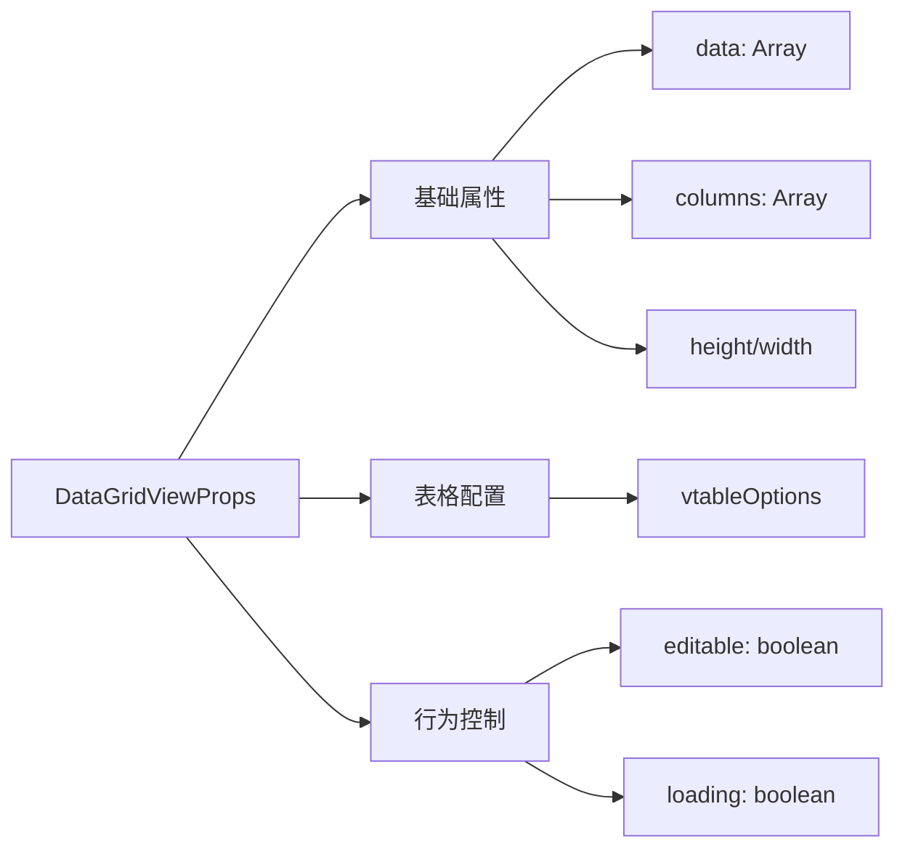
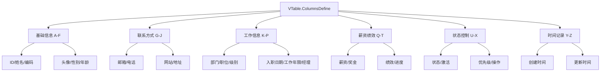
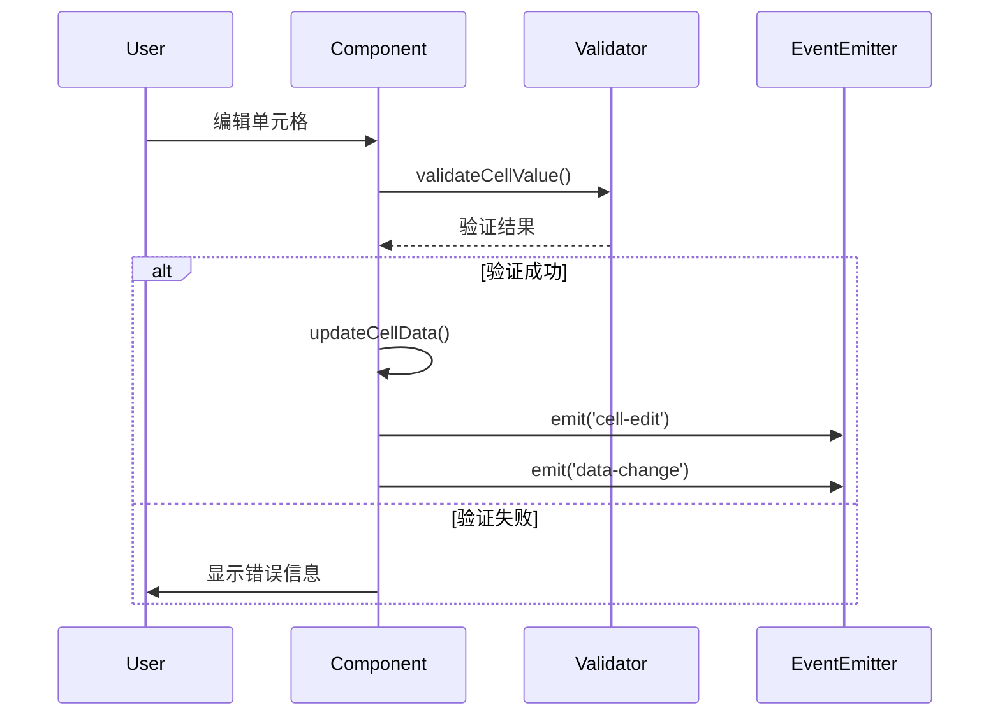
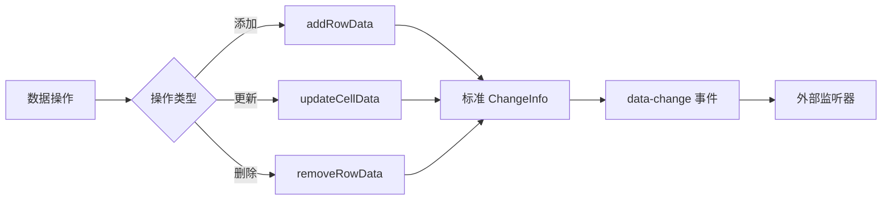

# DataGridView 类型不匹配与代码优化修复设计

## 概述

针对 DataGridView 组件中存在的类型不匹配、过度封装和无效代码问题进行全面修复，确保代码质量和类型安全。

## 问题分析

### 核心问题识别

1. **ChangeInfo 类型不匹配**
   - types.ts 中定义的 ChangeInfo 接口与 editing-helpers.ts 中实际使用不一致
   - removeRowData 函数返回包含 affectedRows 字段，但接口中未定义
   - 类型系统无法正确验证数据变更结构

2. **过度封装问题**
   - processColumns 函数仅做简单透传，无实际处理逻辑
   - buildVTableOptions 函数包含大量无效配置
   - 工具函数层级过深，增加维护复杂度

3. **无效代码识别**
   - EditableTableTest.vue 中 columns 数组为空
   - 部分工具函数功能重复
   - 事件处理逻辑冗余

## 架构重构策略

### 类型系统统一（优先使用VTable官方类型）

**官方类型定义采用原则**

| 类型来源 | 使用优先级 | 说明 |
|----------|------------|------|
| @visactor/vue-vtable | 最高 | 使用 VTable.* 命名空间下的所有类型 |
| @visactor/vtable-editors | 高 | 编辑器相关类型 |
| 自定义类型 | 最低 | 仅在官方类型无法满足时使用 |

**官方类型使用最佳实践（参考vtable-builder.ts）**

```typescript
// ✅ 正确：直接使用VTable官方类型
import type { VTable } from '@visactor/vue-vtable'

// 函数参数使用官方类型
export function processColumns(columns: VTable.ColumnsDefine): VTable.ColumnsDefine {
  return columns // 直接返回，无需额外处理
}

// 配置构建使用官方接口
export function buildVTableOptions(config: {
  theme: any
  columns: VTable.ColumnsDefine  // 官方列定义类型
  records: any[]
  height: string | number
  editable: boolean
  selectable: boolean
  vtableOptions?: VTable.ListTableConstructorOptions  // 官方构造选项类型
}): VTable.ListTableConstructorOptions {
  const baseOptions: VTable.ListTableConstructorOptions = {
    theme: config.theme,
    columns: config.columns,
    records: config.records,
    // 其他VTable原生配置...
  }
  
  return {
    ...baseOptions,
    ...config.vtableOptions
  }
}
```

**类型导入和使用规范**

| 场景 | 正确用法 | 错误用法 |
|------|----------|----------|
| 类型导入 | `import type { VTable } from '@visactor/vue-vtable'` | `import { ColumnConfig } from './types'` |
| 列定义 | `columns: VTable.ColumnsDefine` | `columns: ColumnConfig[]` |
| 单列定义 | `col: VTable.ColumnDefine` | `col: ColumnConfig` |
| 构造选项 | `VTable.ListTableConstructorOptions` | `TableOptions` |
| 返回类型 | `VTable.ColumnsDefine` | `any[]` |

**ChangeInfo 接口重新设计（最小化自定义）**

| 字段名 | 类型 | 必需 | 说明 |
|--------|------|------|------|
| type | 'add' \| 'update' \| 'delete' | ✓ | 变更类型 |
| rowIndex | number | - | 单行操作的行索引 |
| field | string | - | 更新操作的字段名 |
| oldValue | any | - | 原始值 |
| newValue | any | - | 新值 |
| affectedRows | number[] | - | 批量删除操作影响的行索引 |
| affectedData | any[] | - | 受影响的数据记录 |

**统一变更信息结构**

```mermaid
graph TD
    A[ChangeInfo] --> B[单行更新]
    A --> C[添加行]
    A --> D[删除行]
    
    B --> B1[type: 'update']
    B --> B2[rowIndex: number]
    B --> B3[field: string]
    B --> B4[oldValue/newValue]
    
    C --> C1[type: 'add']
    C --> C2[rowIndex: number]
    C --> C3[newValue: object]
    
    D --> D1[type: 'delete']
    D --> D2[affectedRows: number[]]
    D --> D3[affectedData: any[]]
```

### 代码简化原则

**代码简化原则（基于vtable-builder.ts实践）**

| 修复项 | 原因 | 替代方案 | 参考代码 |
|--------|------|----------|----------|
| processColumns函数 | 仅做透传，无处理逻辑 | 直接使用VTable.ColumnsDefine | `return columns` |
| 过度的any类型 | 缺乏类型安全 | 使用官方精确类型 | `VTable.ListTableConstructorOptions` |
| 复杂的配置封装 | 增加维护成本 | 直接透传官方配置 | `...config.vtableOptions` |
| 类型转换逻辑 | 无必要的类型映射 | 保持官方类型一致性 | 直接使用VTable类型 |

**保留核心功能**

- 数据验证逻辑
- 单元格编辑处理
- 数据变更跟踪
- 事件发射机制

## 组件重构设计

### DataGridView 主组件优化

**简化属性接口**



**事件处理优化**

| 事件名 | 参数简化 | 用途 |
|--------|----------|------|
| cell-edit | (rowIndex, field, newValue, oldValue) | 单元格编辑 |
| data-change | (changeInfo: ChangeInfo) | 数据变更通知 |

### 工具函数重构

**editing-helpers.ts 简化**

- `handleCellEditEnd`: 保留核心验证逻辑
- `updateCellData`: 统一返回标准 ChangeInfo
- `addRowData`: 标准化添加行处理
- `removeRowData`: 修复返回类型，支持批量删除

**vtable-builder.ts 重构方案**

**现有问题分析**

```typescript
// ❌ 问题：processColumns函数无效封装
export function processColumns(columns: VTable.ColumnsDefine): any[] {
  return columns.map((col: VTable.ColumnDefine) => {
    return col  // 仅做透传，无任何处理逻辑
  })
}

// ❌ 问题：返回类型不精确
export function buildVTableOptions(...): any {  // 应该返回VTable.ListTableConstructorOptions
  return { ... }
}
```

**优化后的设计**

```typescript
// ✅ 解决方案：删除processColumns，直接使用VTable.ColumnsDefine
// 不需要额外的封装函数

// ✅ 优化：精确的类型定义
export function buildVTableOptions(config: {
  columns: VTable.ColumnsDefine
  vtableOptions?: VTable.ListTableConstructorOptions
}): VTable.ListTableConstructorOptions {
  // 直接使用官方类型，减少类型转换
  const baseOptions: VTable.ListTableConstructorOptions = {
    columns: config.columns,  // 直接使用，无需processColumns
    // 其他原生配置...
  }
  
  return {
    ...baseOptions,
    ...config.vtableOptions  // 直接透传官方配置
  }
}
```

### 测试页面重新设计

### EditableTableTest.vue 列配置（使用VTable官方类型）

**26列完整配置结构（基于VTable.ColumnsDefine）**



**列配置详细定义（严格遵循VTable.ColumnDefine接口）**

| 列标识 | field | title | 类型 | editor | width | 特性 | VTable.ColumnDefine遵循 |
|--------|-------|-------|------|--------|------|------|------------------|
| A | id | ID | number | - | 80 | 只读，排序 | sort: true |
| B | name | 姓名 | string | input | 120 | 可编辑，必填 | editor: 'input-editor' |
| C | code | 员工编号 | string | input | 100 | 可编辑 | editor: 'input-editor' |
| D | avatar | 头像 | string | - | 80 | 图片显示 | cellType: 'image' |
| E | gender | 性别 | string | select | 80 | 选择器 | editor: 'list-editor' |
| F | age | 年龄 | number | number | 80 | 数值，范围限制 | editor: 'input-editor' |
| G | email | 邮箱 | string | email | 180 | 邮箱验证 | editor: 'input-editor' |
| H | phone | 电话 | string | phone | 130 | 电话格式 | editor: 'input-editor' |
| I | website | 网站 | string | url | 150 | URL验证 | editor: 'input-editor' |
| J | address | 地址 | string | textarea | 200 | 多行文本 | editor: 'textarea-editor' |
| K | department | 部门 | string | select | 100 | 部门选择 | editor: 'list-editor' |
| L | position | 职位 | string | select | 120 | 职位选择 | editor: 'list-editor' |
| M | level | 级别 | string | select | 80 | 级别选择 | editor: 'list-editor' |
| N | joinDate | 入职日期 | date | date | 120 | 日期选择 | editor: 'date-input-editor' |
| O | workYears | 工作年限 | number | number | 100 | 数值 | editor: 'input-editor' |
| P | manager | 直属经理 | string | input | 120 | 可编辑 | editor: 'input-editor' |
| Q | salary | 薪资 | number | number | 100 | 数值，货币格式 | editor: 'input-editor' |
| R | bonus | 奖金 | number | number | 100 | 数值 | editor: 'input-editor' |
| S | performance | 绩效 | number | number | 80 | 1-5分 | editor: 'input-editor' |
| T | progress | 进度 | number | number | 80 | 0-100% | editor: 'input-editor' |
| U | status | 状态 | string | select | 80 | 状态选择 | editor: 'list-editor' |
| V | isActive | 激活 | boolean | checkbox | 80 | 布尔值 | cellType: 'checkbox' |
| W | priority | 优先级 | string | select | 80 | 优先级 | editor: 'list-editor' |
| X | actions | 操作 | string | - | 100 | 操作按钮 | cellType: 'link' |
| Y | createTime | 创建时间 | datetime | - | 150 | 只读时间 | sort: true |
| Z | updateTime | 更新时间 | datetime | - | 150 | 只读时间 | sort: true |

## 数据流重构

### 编辑流程优化



### 数据变更跟踪



## 实现优先级

### 第一阶段：类型修复（官方类型优先）
1. 替换所有自定义类型为VTable官方类型
2. 修复 editing-helpers.ts 返回类型匹配
3. 更新组件Props使用VTable.ColumnsDefine
4. 事件处理器直接使用VTable原生事件对象

### 第二阶段：代码简化
1. 删除无效的 processColumns 函数（直接使用VTable.ColumnsDefine）
2. 简化 buildVTableOptions 配置（减少自定义配置项）
3. 直接透传VTable原生配置和事件

### 第三阶段：测试完善
1. 重新生成完整的列配置
2. 补充数据验证规则
3. 完善事件处理逻辑

## 质量保证

### 类型安全检查
- 优先使用@visactor/vue-vtable官方类型定义
- 所有函数返回值与VTable官方接口一致
- 事件参数直接使用VTable原生类型
- 编译时类型错误清零，减少类型转换

### 代码规范遵循
- 单一职责原则：每个函数仅处理一个任务
- 命名规范：采用描述性命名
- 代码复用：消除重复逻辑

### 功能完整性验证
- 所有编辑功能正常运行
- 数据验证规则生效
- 事件发射机制正确