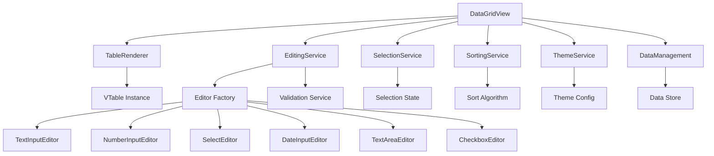
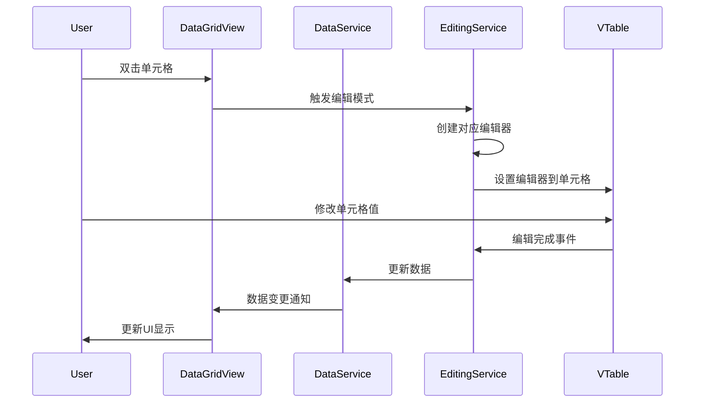
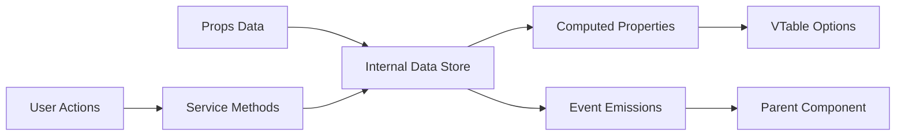

# VTable DataGridView 组件优化设计文档

## 概述

基于第一个quest的初步实现，本文档定义了DataGridView组件的架构优化和功能增强策略。优化重点包括：移除分页功能、扩展测试数据至26列、遵循编码规范重构、以及参考WinForm DataGridView功能特性进行功能补充。

## 技术栈与依赖

### 核心技术栈
- **Vue 3**: Composition API、响应式系统
- **TypeScript**: 类型安全保障
- **VTable**: @visactor/vue-vtable 数据表格引擎
- **VTable Editors**: @visactor/vtable-editors 编辑器扩展

### 主要依赖关系
- Vue 3 响应式系统驱动组件状态管理
- VTable 提供底层表格渲染和交互能力
- TypeScript 提供编译时类型检查
- SCSS 提供样式组织和主题定制

## 架构优化策略

### 单一职责原则重构

当前代码结构分析显示存在职责混合问题，需要按照编码规范进行重构：

#### 组件职责分离
```
DataGridView (主组件)
├── TableRenderer (表格渲染服务)
├── EditingService (编辑功能服务)  
├── SelectionService (选择功能服务)
├── SortingService (排序功能服务)
├── ThemeService (主题管理服务)
└── DataManagement (数据管理服务)
```

#### 服务类设计策略
- **TableRenderer**: 负责VTable实例管理和渲染配置
- **EditingService**: 处理单元格编辑逻辑和编辑器管理
- **SelectionService**: 管理行/单元格选择状态和事件
- **SortingService**: 实现数据排序算法和状态管理
- **ThemeService**: 主题配置加载和动态切换
- **DataManagement**: 数据CRUD操作和状态同步

### 代码复用优化

#### 通用工具函数封装
- **DateFormatter**: 统一日期格式化处理
- **DataValidator**: 数据类型验证和转换
- **EventEmitter**: 标准化事件发布订阅机制
- **ConfigMerger**: 配置对象深度合并工具

#### 编辑器工厂模式
通过工厂模式统一管理不同类型编辑器的创建和配置：

| 编辑器类型 | 实现类 | 配置参数 |
|------------|--------|----------|
| input | TextInputEditor | placeholder, maxLength |
| number | NumberInputEditor | min, max, step, precision |
| select | SelectEditor | options, multiple |
| date | DateInputEditor | format, disabledDate |
| textarea | TextAreaEditor | rows, maxLength |
| checkbox | CheckboxEditor | - |

### 命名与注释规范

#### 命名规范统一
- 函数/变量: 小驼峰命名 (calculateCellWidth, selectedRowIndices)
- 类/接口: 大驼峰命名 (TableRenderer, EditingService)
- 常量: 全大写下划线 (MAX_COLUMN_WIDTH, DEFAULT_ROW_HEIGHT)
- 文件名: 短横线连接 (table-renderer.ts, editing-service.ts)

#### 注释标准化
- 每个函数添加简要功能说明
- 关键算法添加实现原理注释
- 复杂逻辑块添加"为什么"注释

## 功能移除与优化

### 分页功能移除

#### 移除原因
- 简化组件复杂度
- 专注于数据表格核心功能
- 减少状态管理复杂性

#### 移除范围
- 删除分页相关Props定义
- 移除分页UI组件和样式
- 清理分页相关计算逻辑
- 删除分页事件处理函数

#### 数据处理优化
移除分页后，所有数据操作直接作用于完整数据集，简化数据索引计算逻辑。

### 测试数据扩展至26列

#### 列定义扩展策略
设计26个不同类型和用途的列，全面测试组件能力：

| 列分类 | 列名示例 | 数据类型 | 编辑器类型 |
|--------|----------|----------|------------|
| 基础信息 | ID, Name, Code | string/number | input/readonly |
| 联系方式 | Email, Phone, Address | string | input/textarea |
| 日期时间 | CreateDate, UpdateDate, Birthday | date | date |
| 数值计算 | Price, Quantity, Total, Discount | number | number |
| 选择枚举 | Status, Category, Priority, Type | enum | select |
| 布尔判断 | IsActive, IsDeleted, IsPublic | boolean | checkbox |
| 长文本 | Description, Comments, Notes | text | textarea |

#### 测试场景覆盖
- 不同编辑器类型的功能验证
- 大数据量渲染性能测试
- 列宽自适应和用户调整
- 水平滚动和虚拟化表现

## 架构组件设计

### 组件层次结构



### 数据流设计



### 状态管理架构

#### 响应式状态设计


#### 状态更新策略
- **数据同步**: Props变更自动同步到内部状态
- **事件驱动**: 用户操作通过事件驱动状态变更
- **单向数据流**: 保持数据流向的可预测性

## 参考WinForm DataGridView功能特性分析

### 核心功能对比分析

| 功能类别 | WinForm DataGridView | 当前VTable实现 | 优化建议 |
|----------|---------------------|---------------|----------|
| 列类型支持 | TextBox, ComboBox, CheckBox, Button, Image, Link | Input, Select, Date, Checkbox | 增加Button, Image, Link列类型 |
| 单元格编辑 | 双击/F2/直接输入 | 双击/Enter | 增加F2和直接输入支持 |
| 数据验证 | 内置验证机制 | 基础验证 | 增强验证机制和错误提示 |
| 行操作 | 新增、删除、插入 | 基础支持 | 增强行操作UI和快捷键 |
| 列操作 | 隐藏、排序、调整宽度 | 基础支持 | 增加列隐藏和右键菜单 |
| 选择模式 | Cell, Row, Column, FullRow | Row/Cell | 增加Column选择模式 |
| 数据绑定 | 双向绑定 | 单向绑定 | 增强双向绑定能力 |
| 格式化 | 数值、日期格式化 | 基础格式化 | 增强格式化选项 |
| 冻结功能 | 行列冻结 | 基础支持 | 完善冻结功能 |

### 待补充功能清单

#### 高优先级功能
1. **Button列类型**: 支持按钮列用于操作触发
2. **Image列类型**: 支持图片显示和预览
3. **Link列类型**: 支持超链接显示和跳转
4. **列右键菜单**: 提供列操作上下文菜单
5. **行右键菜单**: 提供行操作上下文菜单
6. **键盘导航增强**: 支持方向键、Tab、Enter导航
7. **数据验证增强**: 实时验证和错误提示
8. **格式化增强**: 数值、货币、百分比格式化

#### 中优先级功能
1. **多列排序**: 支持按多个字段组合排序
2. **列分组**: 支持列头分组显示
3. **行分组**: 支持数据按字段分组
4. **筛选器增强**: 多条件筛选和自定义筛选
5. **导出功能增强**: 支持Excel、CSV、PDF导出
6. **打印功能**: 支持表格打印和打印预览
7. **列自动调整**: 双击列边界自动调整列宽

#### 低优先级功能
1. **虚拟滚动优化**: 大数据集性能优化
2. **拖拽功能**: 行列拖拽重排
3. **撤销重做**: 编辑操作的撤销重做
4. **数据透视**: 简单的数据透视表功能
5. **图表集成**: 数据可视化图表嵌入
6. **多语言支持**: 国际化文本支持

## 接口与类型定义优化

### 类型系统重构

#### 编辑器类型扩展
```typescript
interface EditorConfig {
  type: 'input' | 'number' | 'select' | 'date' | 'checkbox' | 'textarea' | 'button' | 'image' | 'link'
  // 其他配置属性保持不变
}
```

#### 列配置增强
```typescript
interface ColumnConfig {
  // 现有属性保持不变
  cellType?: 'text' | 'button' | 'image' | 'link' | 'progress'
  formatter?: (value: any, row: any) => string
  validator?: (value: any) => ValidationResult
  rightClickMenu?: ContextMenuConfig
}
```

#### 组件方法接口扩展
```typescript
interface DataGridViewMethods {
  // 现有方法保持不变
  
  // 新增方法
  showColumn: (field: string) => void
  hideColumn: (field: string) => void
  freezeColumn: (field: string, position: 'left' | 'right') => void
  unfreezeColumn: (field: string) => void
  autoFitColumns: () => void
  validateData: () => ValidationResult[]
  exportToExcel: (filename?: string) => void
  exportToCsv: (filename?: string) => void
}
```

## 性能优化策略

### 渲染性能优化
- **虚拟滚动**: 利用VTable原生虚拟滚动能力处理大数据集
- **按需渲染**: 仅渲染可视区域的单元格内容
- **编辑器复用**: 编辑器实例复用减少创建销毁开销

### 内存管理优化
- **及时清理**: 组件销毁时清理事件监听和定时器
- **弱引用**: 对大对象使用弱引用避免内存泄漏
- **数据分片**: 大数据集进行分片处理

### 交互体验优化
- **防抖处理**: 用户输入操作进行防抖优化
- **加载状态**: 提供明确的加载和处理状态反馈
- **错误恢复**: 操作失败时提供恢复机制

## 测试策略

### 单元测试范围
- 各个服务类的独立功能测试
- 数据处理函数的边界条件测试
- 编辑器创建和配置的正确性测试

### 集成测试范围
- 组件间协作的端到端测试
- 用户交互流程的完整性测试
- 数据一致性和同步的正确性测试

### 性能测试指标
- 大数据集(10万行)渲染性能
- 编辑操作响应时间
- 内存使用情况监控